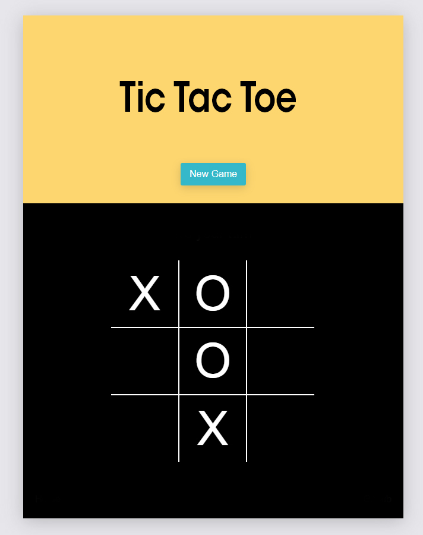

# 2.Hafta Ödevi

## Film Listesi

# Link: [film-listesi-odevi-furk2sahin.surge.sh](http://film-listesi-odevi-furk2sahin.surge.sh)


Component kavramını daha iyi anlayabilmek için bir film listesi yapabilirsiniz.
Listeleme işlemi için gerekli veri projeye eklendi(movies.js).

```js
App.js

import movies from './movies';
```


### Veri Önizlenimi

```js
 {
    id: 1,
    title: 'Pursuit of Happyness, The',
    description: 'Drama',
  },
  {
    id: 2,
    title: "Alabama Moon",
    description: "Adventure|Children|Drama"
  },
```

**Not:** Veriler [https://www.mockaroo.com](https://www.mockaroo.com) yardımıyla üretilmiştir.


# 3.Hafta Ödevi

## Tic Tac Toe Oyunu

#  Link: [tic-tac-toe-oyunu-furk2sahin.surge.sh](http://tic-tac-toe-oyunu-furk2sahin.surge.sh)


2 kişinin oynayabileceği bir Tic Tac Toe oyunu yapmanızı bekliyoruz. Tasarımı size kalmakla birlikte referans olması açısından bir görsel ekledik.

### Oyun Akışı
- Kullanıcı hamlelerinden birisi "X" ile ifade edilirken, diğeri "O" ile ifade edilecek.
- Tıklama aksiyonunda sıralamaya göre "X" veya "O" ekleme işlemi yapılacak.
- Dikey, yatay veya çapraz olarak aynı tipteki ikonları sıralayabilen oyuncu oyunu kazanır.
- Kazanma, kaybetme ve beraberlik durumlarında sonuç ekranda gösterilecek. 

Detaylı oyun kuralları için [tıklayabilirsiniz](https://www.exploratorium.edu/brain_explorer/tictactoe.html). 



## Kurulum

Projeyi lokalde çalıştırabilmek için: 

* Repo'yu klonlayın `git clone https://github.com/ReactBootcamp66/tic-tac-toe-odevi.git`
* Komutu çalıştırın `cd tic-tac-toe`
* Komutu çalıştırın `npm install` veya `yarn install`
* Komutu çalıştırın `npm start` veya `yarn install` 

# 4.Hafta Ödevi

## Mcking Burger

# Link: [mcking-burger-online-furk2sahin.surge.sh](http://mcking-burger-online-furk2sahin.surge.sh)


Bu ödevde online hamburger siparişi verebileceğimiz bir sistem yapacağız.

## Giriş

Mcking Burger adında bir şirketimiz var ve buradan müşterilerimizin online hamburger verebilmesini istiyoruz.

Not: Ödevde ihtiyaç duyduğunuz bilgileri `alt tarafta` ekledik.

- Hamburger tasarımı için gerekli olan css kodları
- Sizden beklediğimiz sonucun ekran görüntüleri

## İstenilenler

- 2 sayfadan oluşmalıdır.
  -- Anasayfa: Hamburgeri oluşturma işlemini yapıp ve siparişi tamamla diyebilmelidir.
  -- Sonuç ekranı: Vermiş olduğu siparişin son hali ve bir mesaj(Ör: 'Siparişiniz başarı bir şekilde oluşturuldu.' diyebilirsiniz. )
- Müşteri istediği kadar salata, peynir ve et ekleyebilmelidir. Seçilen ürünler sırasıyla peynir, salata ve et olacak şekilde dizilmelidir.

  **Ör-1:** Müşteri 2 tane peynir ve 1 et seçtiyse;

  ```html
  <div class="burger">
    <div class="bread-top"></div>
    <div class="cheese"></div>
    <div class="cheese"></div>
    <div class="meat"></div>
    <div class="bread-bottom"></div>
  </div>
  ```

  **Ör-2:** Müşteri 1 tane peynir, 1 adet salata ve 1 et seçtiyse;

  ```html
  <div class="burger">
    <div class="bread-top"></div>
    <div class="cheese"></div>
    <div class="salad"></div>
    <div class="meat"></div>
    <div class="bread-bottom"></div>
  </div>
  ```

  **Ekran görüntüleri en alttadır.**

- Eklenen ürünlerin birim fiyatları olacak ve altta bu toplam fiyat gösterilmelidir.

## Ürün bilgileri

Ürünlerin birim fiyatları alttaki gibidir.

```js
const INGREDIENT_UNIT_PRICES = {
  salad: 0.5,
  cheese: 0.4,
  meat: 1.3,
};
```

**Sipariş Başlangıç Tutarı: 4.00'dür** ve eklenen her ürün hesaplanıp(**adet \* birim fiyat**) başlangıç fiyatının üstüne eklenmelidir.

## Yardımcı css kuralları

```css
.burger {
  width: 700px;
  height: 600px;
}

.bread-top {
  height: 20%;
  width: 80%;
  background: linear-gradient(#bc581e, #e27b36);
  border-radius: 50% 50% 0 0;
  box-shadow: inset -15px 0 #c15711;
  margin: 2% auto;
  position: relative;
}

.bread-bottom {
  height: 13%;
  width: 80%;
  background: linear-gradient(#f08e4a, #e27b36);
  border-radius: 0 0 30px 30px;
  box-shadow: inset -15px 0 #c15711;
  margin: 2% auto;
}

.salad {
  width: 85%;
  height: 7%;
  margin: 2% auto;
  background: linear-gradient(#228c1d, #91ce50);
  border-radius: 20px;
}

.cheese {
  width: 90%;
  height: 4.5%;
  margin: 2% auto;
  background: linear-gradient(#f4d004, #d6bb22);
  border-radius: 20px;
}

.meat {
  width: 85%;
  height: 7%;
  margin: 2% auto;
  background: linear-gradient(#228c1d, #91ce50);
  border-radius: 20px;
}
```

## Ekran Görüntüleri

### Başlangıç Noktası


### Örnek-01


### Örnek-02


# 5.Hafta Ödevi

## Todo App
# Link: [todo-api-furk2sahin.surge.sh](http://todo-api-furk2sahin.surge.sh)

Arkadaşlar bu haftaki ödevinizde api kullanarak bir todo app yapmanız gerekiyor.

## Model

```js
todos {
title: string;
isDone: boolean;
user: string;
}
```

Örnek:

```js
{
title: 'Test 1',
isDone: false,
user: 'github.username'
}
```

## Servis adresi

Herkes aynı servisi kullanacak. Bu yüzden gelen Tek bir servis olacaktır.
Bu yüzden tüm listeyi aldıktan sonra user bazlı bir filtreleme yapmanız gerekmektedir.

_Base URL:_ https://5fa97367c9b4e90016e6a7ec.mockapi.io/api

_Not:_ veri eklerken user bilgisine kendi github kullanıcı adınızla beraber gönderiniz.

## Adresler

- Tüm liste: GET: <https://5fa97367c9b4e90016e6a7ec.mockapi.io/api/todos>
- Yeni oluşturma: POST: <https://5fa97367c9b4e90016e6a7ec.mockapi.io/api/todos>
- Güncelleme: PUT: <https://5fa97367c9b4e90016e6a7ec.mockapi.io/api/todos>
- Silme: DELETE: <https://5fa97367c9b4e90016e6a7ec.mockapi.io/api/todos/:id>

## Beklenilenler

Sayfa limitiniz yoktur. İstediğiniz kadar sayfa yapabilirsiniz.
Beklenilen özellikler;

- Listeleme
- Ekleme
- Güncelleme
- Sileme

# Ekran görüntüsü


# Bitirme Ödevi

## Live on

[reactbootcamp66-furk2sahin-bitirme-odevi.vercel.app](https://reactbootcamp66-furk2sahin-bitirme-odevi.vercel.app)

## Parking owner accounts:

Account 1;

  username: owner1
  password: owner1
  
Account 2;

  username: owner2
  password: owner2

## User accounts:

Account 1:

  username: user1
  password: user1
  
Account 2;

  username: user2
  password: user2
  
Account 3;

  username: user3
  password: user3
  
Account 4;

  username: user4
  password: user4
 
## Employee accounts;

Account1;

  username: employee1
  password: employee1
  
Account2;

  username: employee2
  password: employee2
  
Account3;

  username: employee3
  password: employee3
  
Account4;

  username: employee4
  password: employee4

## Sunum
[gitbook.io/parking-sunum/](https://2017123057.gitbook.io/parking-sunum/)

Bu ödevde aşağıda belirtilen kriterleri karşılayan ve içerik konusunda serbest olduğunuz bir uygulama yapmanız isteniyor.

## İstenilenler

- Min. 5 sayfadan oluşmalıdır.
- 10 tane component testi yazmanız beklenmektedir.
- Servis için [Mockapi.io](https://www.mockapi.io/) kullanabilirsiniz. Bunun için üyelik oluşturmanız gerekmektedir.
- Proje bittikten sonra [Netlify](https://www.netlify.com/) üzerinden projeyi deploy etmeniz gerekmektedir.

## Kullanılması gereken kütüphaneler

- [React Router](https://www.npmjs.com/package/react-router)
- [Styled component](https://www.npmjs.com/package/styled-components)
- [React testing library](https://www.npmjs.com/package/@testing-library/react)
- [Axios](https://www.npmjs.com/package/axios)
- [@testing-library/user-event](https://www.npmjs.com/package/@testing-library/user-event)

### Not:

- Test ve deployment konusu şu an için bekleyebilir. Önümüzdeki iki hafta deployment ve test konusunu işledikten sonra projenize bunları dahil edebilirsiniz.

