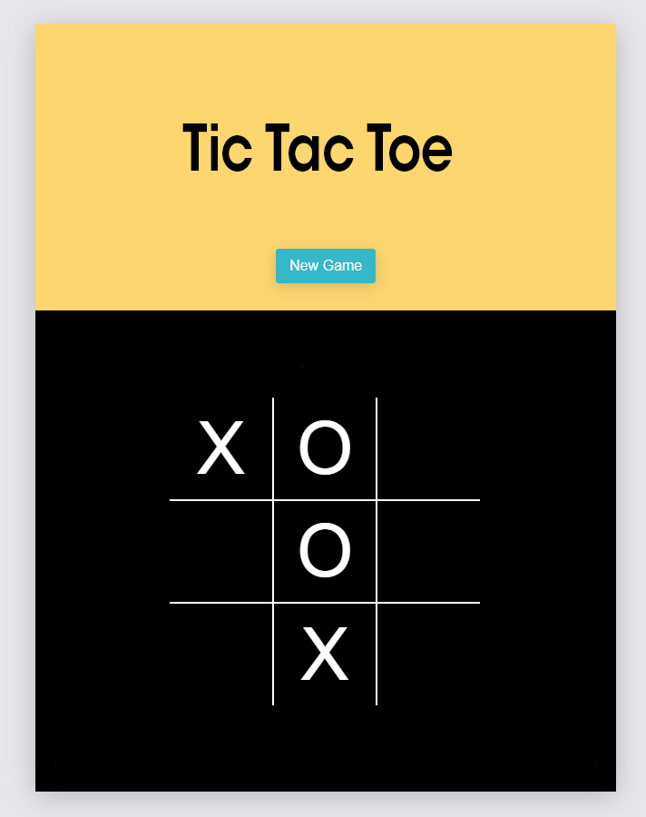

# 3.Hafta Ödevi

## Tic Tac Toe Oyunu

2 kişinin oynayabileceği bir Tic Tac Toe oyunu yapmanızı bekliyoruz. Tasarımı size kalmakla birlikte referans olması açısından bir görsel ekledik.

### Oyun Akışı
- Kullanıcı hamlelerinden birisi "X" ile ifade edilirken, diğeri "O" ile ifade edilecek.
- Tıklama aksiyonunda sıralamaya göre "X" veya "O" ekleme işlemi yapılacak.
- Dikey, yatay veya çapraz olarak aynı tipteki ikonları sıralayabilen oyuncu oyunu kazanır.
- Kazanma, kaybetme ve beraberlik durumlarında sonuç ekranda gösterilecek. 

Detaylı oyun kuralları için [tıklayabilirsiniz](https://www.exploratorium.edu/brain_explorer/tictactoe.html). 

## Kurulum

Projeyi lokalde çalıştırabilmek için: 

* Repo'yu klonlayın `git clone https://github.com/ReactBootcamp66/tic-tac-toe-odevi.git`
* Komutu çalıştırın `cd tic-tac-toe`
* Komutu çalıştırın `npm install` veya `yarn install`
* Komutu çalıştırın `npm start` veya `yarn install` 